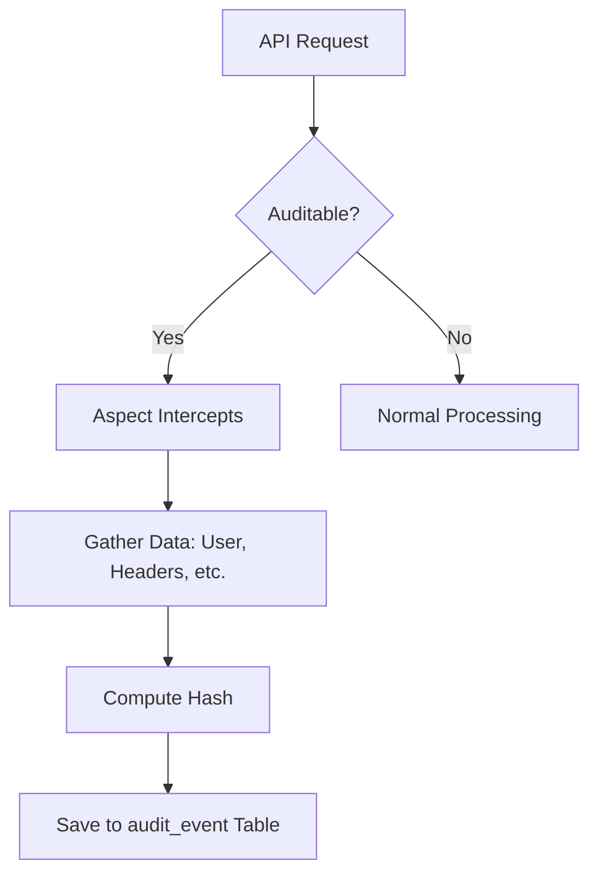
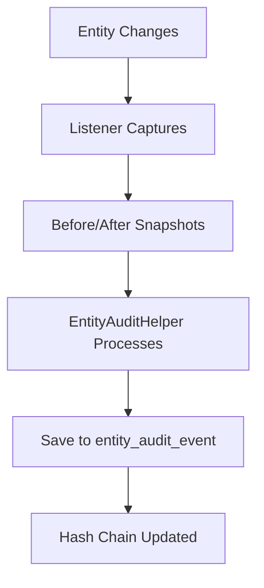
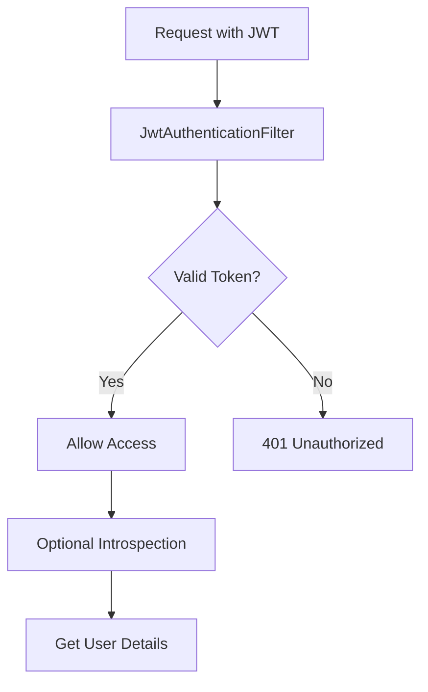
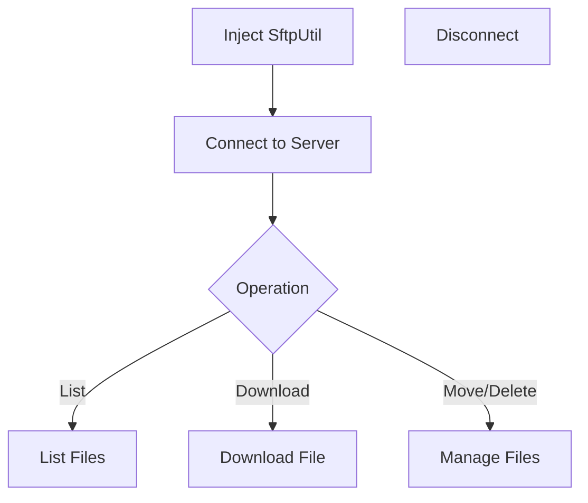
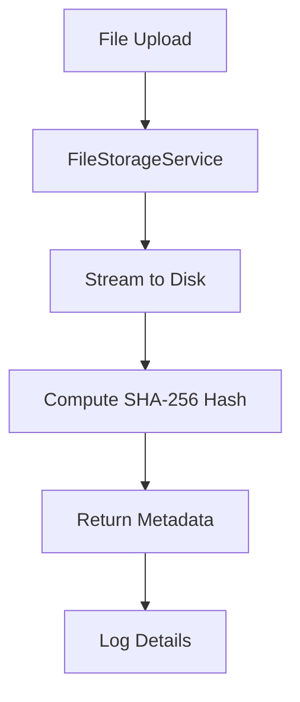

# Shared Library Novice Guide

Welcome! This guide is designed for beginners to help you understand and use the `shared-lib` JAR in your Spring Boot applications. We'll break down each feature into simple steps, with diagrams to visualize how things work.

## What is Shared-Lib?

Shared-Lib is a collection of reusable tools for Spring Boot apps. It includes features like auditing, security, file handling, and more. Each feature is optional, so you only use what you need.

## Quick Start Checklist

Before diving in, here's a simple checklist to get started:

1. **Add the JAR to your project:** Include `shared-lib` in your dependencies.
2. **Choose features:** Decide which modules you want (see table below).
3. **Enable in config:** Set properties like `shared-lib.audit.enabled=true` in `application.yml`.
4. **Scan packages:** Make sure your `@SpringBootApplication` scans `com.shared`.
5. **Set up databases/tables:** If using audit features, create the required tables.
6. **Test:** Run your app and check logs for auto-configuration messages.

## Module Overview

Here's a table of available features:

| Feature | Enable Property | What It Does | Needs |
| --- | --- | --- | --- |
| Core Config | Always on | Binds properties | Nothing |
| HTTP Filters | `shared-lib.filters.enabled=true` | Adds request ID and signature checks | Web app |
| API Audit | `shared-lib.audit.enabled=true` | Logs API calls | Database table |
| Entity Audit | `shared-lib.entity-audit.enabled=true` | Tracks entity changes | JPA, database table |
| JWT Security | `shared-lib.security.enabled=true` | Handles JWT tokens | Spring Security |
| SFTP Client | `shared-lib.sftp.enabled=true` | Transfers files via SFTP | JSch library |
| File Upload | `shared-lib.file-upload.enabled=true` | Saves uploaded files | Writable folder |

---

## Step-by-Step: API Audit Trail

**What it does:** Records every API call for security and debugging.

### How It Works (Diagram)



### Steps to Enable

1. **Enable the feature:** In `application.yml`, add:
   ```
   shared-lib:
     audit:
       enabled: true
   ```
2. **Create the table:** Run the SQL from `create_audit_table.sql` in your database.
3. **Annotate methods:** Add `@Auditable` to methods you want to track.
   ```java
   @Auditable(resourceId = "#id", details = "{'action': 'update'}")
   public void updateItem(Long id) { ... }
   ```
4. **Or use manually:** Inject `AuditHelper` and call `recordEvent(...)`.
5. **Check logs:** Look for audit entries in your database.

---

## Step-by-Step: Entity Audit Trail

**What it does:** Tracks changes to your data entities.

### How It Works (Diagram)



### Steps to Enable

1. **Enable the feature:** In `application.yml`:
   ```
   shared-lib:
     entity-audit:
       enabled: true
   ```
2. **Create the table:** Run the DDL for `entity_audit_event`.
3. **Annotate entities:** Add `@EntityAuditEnabled` to your JPA entities.
   ```java
   @Entity
   @EntityAuditEnabled
   public class MyEntity implements EntityAuditDescriptor {
       // Implement auditState() method
   }
   ```
4. **Implement descriptor:** Override `auditState()` to return fields to track.
5. **Scan packages:** Ensure `com.shared` is scanned for the listener.

---

## Step-by-Step: JWT Security

**What it does:** Secures your app with JWT tokens.

### How It Works (Diagram)



### Steps to Enable

1. **Enable security:** In `application.yml`:
   ```
   shared-lib:
     security:
       enabled: true
   app:
     jwt:
       secret: your-secret
       issuer: your-issuer
   ```
2. **Configure JWT:** Set `app.jwt.secret`, `issuer`, `audience`.
3. **Optional introspection:** Set `shared-lib.security.introspection.url` if needed.
4. **Whitelist paths:** Use `shared-lib.security.permitted-paths` for public endpoints.
5. **Access details:** In controllers, get user info from `JwtAuthenticationDetails`.

---

## Step-by-Step: SFTP Utility

**What it does:** Lets you transfer files via SFTP.

### How It Works (Diagram)



### Steps to Enable

1. **Enable SFTP:** In `application.yml`:
   ```
   shared-lib:
     sftp:
       enabled: true
       host: sftp.example.com
       username: user
       password: pass
   ```
2. **Add dependency:** Include JSch in your pom.xml.
3. **Use in code:** Inject `SftpUtil` and call methods.
   ```java
   @Autowired
   private SftpUtil sftpUtil;

   public void download() {
       sftpUtil.connect();
       sftpUtil.downloadFile("remote.txt", "local.txt");
       sftpUtil.disconnect();
   }
   ```

---

## Step-by-Step: File Upload Helper

**What it does:** Handles file uploads securely.

### How It Works (Diagram)



### Steps to Enable

1. **Enable (default on):** In `application.yml`:
   ```
   shared-lib:
     file-upload:
       enabled: true
       base-dir: /uploads
   ```
2. **Use in controller:** Inject `FileStorageService`.
   ```java
   @PostMapping("/upload")
   public FileMetadata upload(@RequestParam MultipartFile file) {
       return fileStorageService.storeFile(file, "category");
   }
   ```

---

## Other Features

- **HTTP Filters:** Enable with `shared-lib.filters.enabled=true` for request IDs and signatures.
- **Pagination:** Use `SecurePaginationRequest` for safe paging.
- **Exceptions:** Automatic error handling with `GlobalExceptionHandler`.

## Troubleshooting

- **Modules not loading:** Check if `com.shared` is scanned.
- **Database errors:** Ensure tables exist and DataSource is configured.
- **Security issues:** Verify JWT secrets and paths.

## References

- `README.md` for code examples.
- `SharedLibIntegrationGuide.md` for advanced setup.
- Test files for sample usage.

